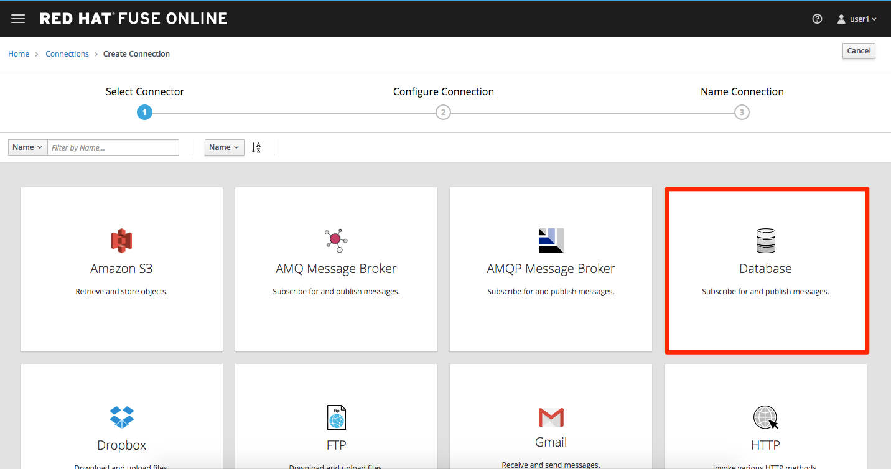
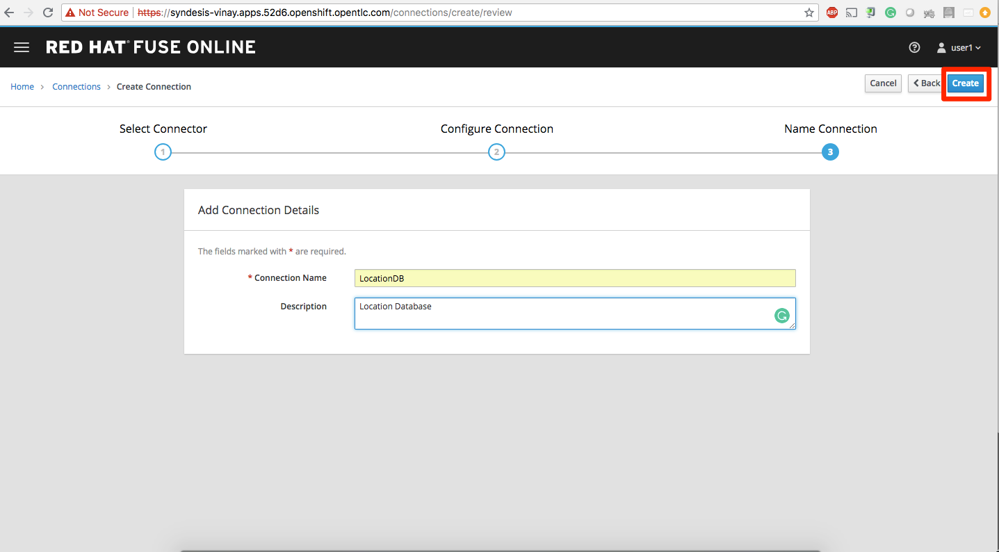
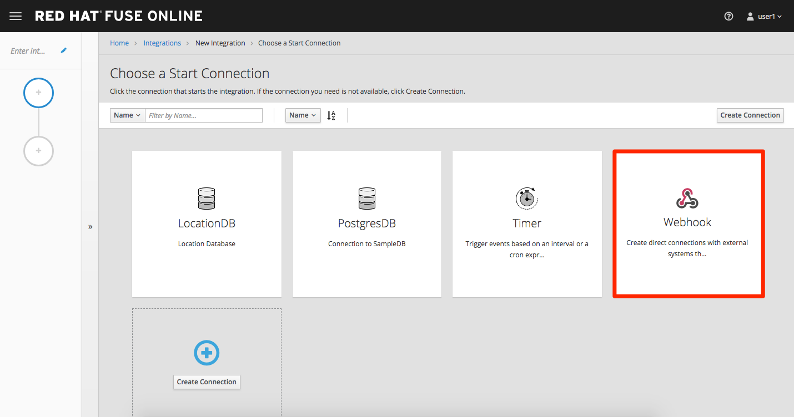
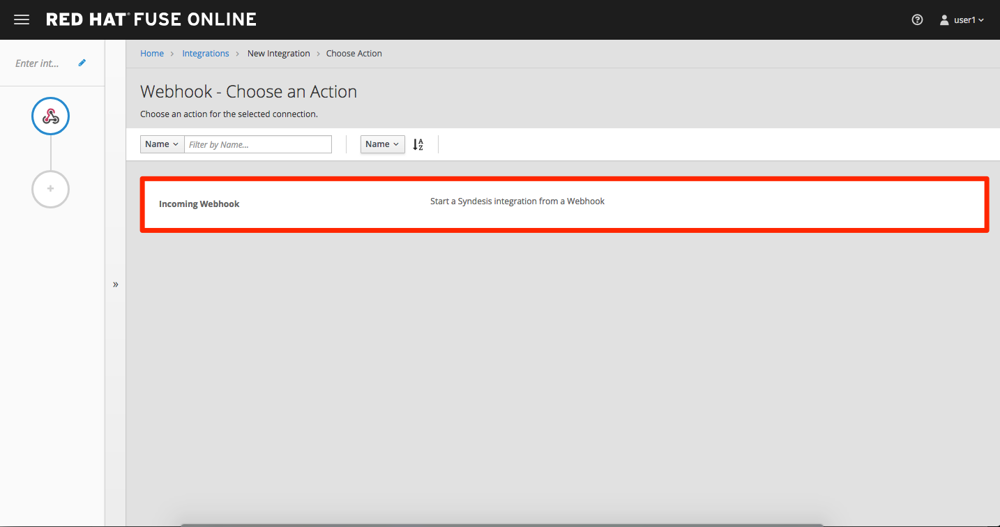
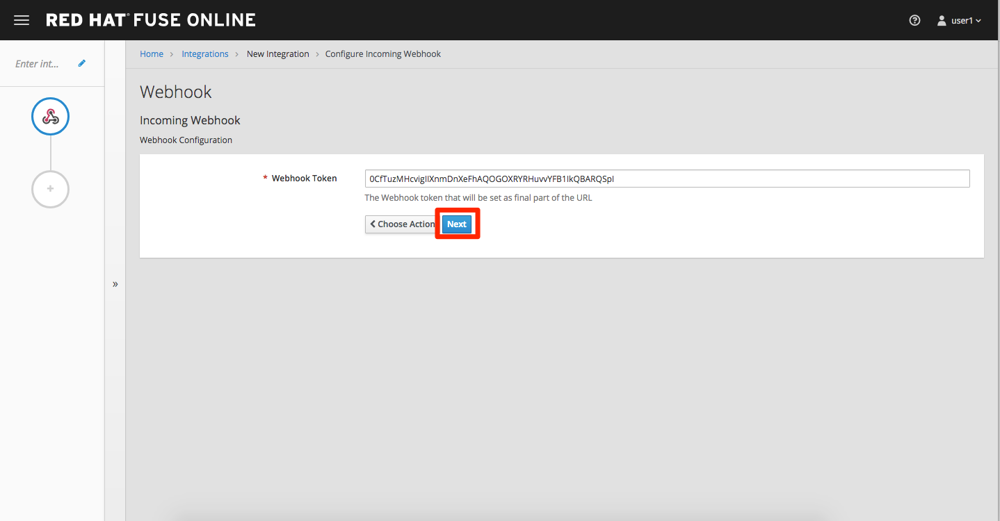
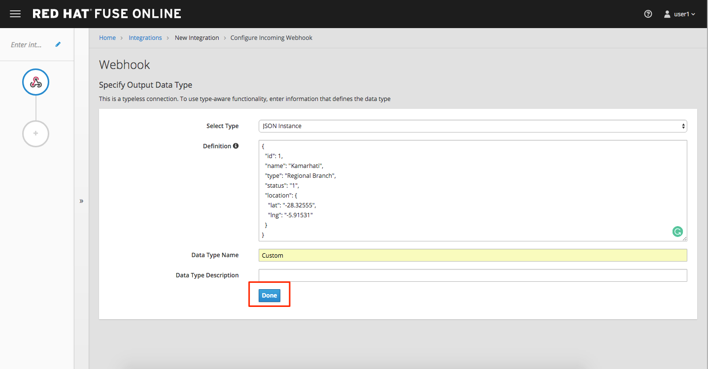
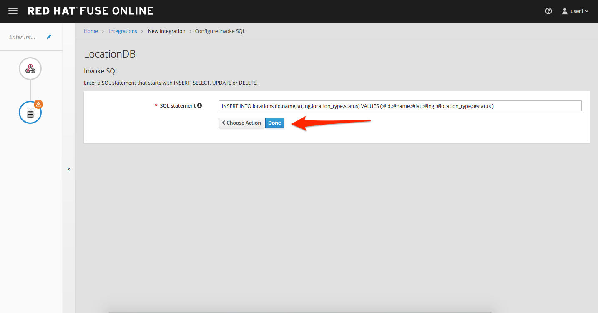
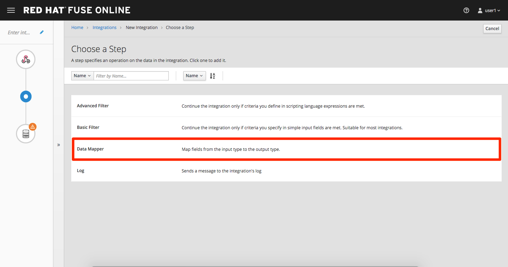
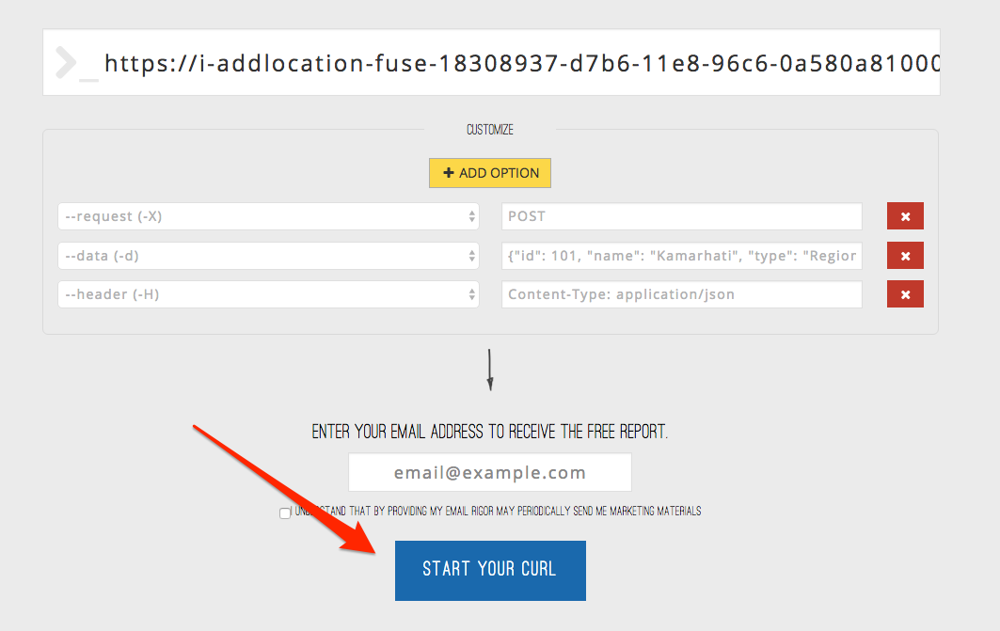

# Lab 3

## Fuse Online

* Duration: 20 mins
* Audience: Developers and Architects

## Overview

When it comes to quick API development, you need both the integration experts as well as application developers to easily develop and deploy the APIs. Here is how to create a simple API with Fuse Online. 

### Why Red Hat?

Red Hat Fuse integration solution empowers integration experts, application developers, and business users to engage in enterprise-wide collaboration and high-productivity self-service. 


### Environment

**Credentials:**

Your username is your assigned user number. For example, if you are assigned user number **1**, your username is: 

```bash
user1
```

Please ask your instructor for your password.

**URLs:**

If you haven't done so already, you need to login to the **Red Hat Solution Explorer** webpage so that a unique lab environment can be provisioned on-demand for your exclusive use.  You should open a web browser and navigate to: 

```bash
https://tutorial-web-app-webapp.dil.opentry.me
```

You will be presented with a login page where you can enter your unique credentials:


Enter your credentials and click **Log in**.  You'll notice a web-page appear which explains that a *unique environment* is being provisioned.


Once the environment is provisioned, you will be presented with a page that presents all the available applications which you'll need in order to complete the labs:


## Lab Instructions

### Step 1: Create database connection

1. Via the **Red Hat Solution Explorer** webpage, click the **Red Hat Fuse** link:

   

1. The first time that you hit the Fuse Online URL, you will be presented with an *Authorize Access* page.  Click the **Allow selected permissions** button to accept the defaults.

   

1. Click on **Connections > Create Connection**

   

1. Select **Database**

   

1. Enter below values for Database Configuration

    ```
    Connection URL: jdbc:postgresql://postgresql.international.svc:5432/sampledb
    Username      : dbuser
    Password      : password
    Schema        : <blank>
    ```

1. Click **Validate** and verify if the connection is successful. Click **Next** to proceed.

  

6. Add `Connection details`. `Connection Name: LocationDB` and `Description: Location Database`. Click **Create**.
   
   

7. Verify that the `Location Database` is successfully created.

### Step 2: Create webhook integration

1. Click on **Integrations > Create Integration** 

  

2. Choose **Webhook**

  

3. Click on `Incoming Webhook` 

  

4. It navigates to the `Webhook Token` screen. Click **Next**

  

5. Define the Output Data Type. `Select type` from the dropdown as `JSON instance`. Enter `Data type Name: Custom`. `Definition: `, copy below JSON data. Click **Done**.

    ```
		{
		  "id": 1,
		  "name": "Kamarhati",
		  "type": "Regional Branch",
		  "status": "1",
		  "location": {
		    "lat": "-28.32555",
		    "lng": "-5.91531"
		  }
		}
    ```

 

6. Click on `LocationDB` from the catalog and then select `Invoke SQL`

 

7. Enter the SQL statement. Click **Done**.

 ```
   INSERT INTO locations (id,name,lat,lng,location_type,status) VALUES (:#id,:#name,:#lat,:#lng,:#location_type,:#status )
 ```

 

8. Click on `Add step` and select `Data mapper`

 

9. Drag and drop the matching **Source** Data types to all their corresponding **Targets** as per the following screenshot. When finished, click **Done**.

 

10. Click **Publish** on the next screen and add `Integration Name: addLocation`. Again Click **Publish**.

 

*Congratulations*. You sucessfully published the integration. (Wait for few minutes to build and publish the integration)

### Step 3: Create a POST request

We will use an online cURL tool to create your own record field in database.

1. Copy the `External URL` per the below screenshot

   

1. Open a browser window and navigate to:

   ```
     https://onlinecurl.com/
   ```

1. Below are the values for your requests. Remember to click on **+ Add Option** to add additional parameters to the request. Note: `id:101` in the payload as we are creating `101th` record in the database. 

   | Parameters | Values |
   | --- | --- |
   | URL | external copied url from Step 3.1 |
   | --header (-H) | Content-Type: application/json |
   | --data (-d)  |   {"id": 101, "name": "Kamarhati", "type": "Regional Branch", "status": "1", "location": { "lat": "-28.32555", "lng": "-5.91531" }} |
   | --request (-X) | POST |


   

1. The page will load the `204` response information from the service which means the request was successfully fulfilled.

   


1. Click on **Activity > Refresh** and verify if the newly record is created.

   

1. _(Optional)_ Visit the application URL in the browser and verify if the record can be fetched.  *Replace `101` in the URI with your corresponding user number.*

  **REQUEST**
  ```
   http://location-service-international.dil.opentry.me/locations/101
  
  ```

  **RESPONSE**
  ```
    {
      "id" : 101,
      "name" : "Kamarhati",
      "type" : "Regional Branch",
      "status" : "1",
      "location" : {
        "lat" : "-28.32555",
        "lng" : "-5.91531"
      }
    }
  ```

## Summary

In this lab you discovered how to create an adhoc API service using Fuse Online. 

You can now proceed to [Lab 4](../lab04/#lab-4)


## Notes and Further Reading

* Fuse Online
  * [Webpage](https://www.redhat.com/en/technologies/jboss-middleware/fuse-online)
  * [Sample tutorials](https://access.redhat.com/documentation/en-us/red_hat_fuse/7.1/html-single/fuse_online_sample_integration_tutorials/index)
  * [Blog](https://developers.redhat.com/blog/2017/11/02/work-done-less-code-fuse-online-tech-preview-today/)

